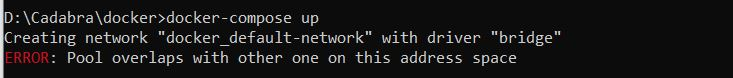

Docker setup
===============

The Docker environment project.

## Directory structure
```
├─ docker-compose.yml
│
├─ apache
│   ├─ conf
│   │   ├─ sites-enabled
│   │   │   ├─ 000-default.conf
│   │   ├─ apache2.conf
|   ├─ php
│   │   └─ php.ini
│   ├─ ssl
│   │   ├─ certs
│   │   │   └─ local.crt
│   │   └─ private
│   │       └─ local.key
│   └─ Dockerfile
├─ ubuntu
│   └─ Dockerfile
│
├─ .env.example
│
```

## Setup manual
**1. Install Docker Desktop on Windows**:

- Download Docker Desktop for Windows. </br>
  https://hub.docker.com/editions/community/docker-ce-desktop-windows/

(*) Requires Microsoft Windows 10 Professional or Enterprise 64-bit, or Windows 10 Home 64-bit with WSL 2.

**2. Modify project path**

Copy and rename the '.env.example' file to '.env'.

Modify the source directory in .env file.
```
SOURCE_PATH=<SOURCE DIRECTORY>
VOLUME_PATH=/var/www/html
```

- Application will be mounted to `/var/www/html`

You may modify project paths <SOURCE DIRECTORY> in above directory with your local paths.

Eg:
```
SOURCE_PATH=C:\workspace\laravel-react-project
```

- Modify others configurations if needed.</br>
eg: you can modify the port number of http/https instead of the default configuration shown below.
```
APP_PORT=80
APP_SSL_PORT=443
```

**3. Check configuration of Apache server**
1/ Directory apache/conf/sites-enabled
- Change ServerName and DocumentRoot
Eg:
```
  ...
  ServerName example.com
  ...
  DocumentRoot /var/www/html/my_app/public
  ...
```

2/ Directory apache\conf\apache2.conf
```
...
<VirtualHost *:80>
    ...
    DocumentRoot "/var/www/html/my_app/public"

    <Directory /var/www/html/my_app/public>
        ...
    </Directory>

    ...
</VirtualHost>
...
```
3/ Directory apache/Dockerfile
Change SOURCE_NAME, HOSTNAME

```
...
ENV SOURCE_NAME=my_app
ENV HOSTNAME=example.com
...
```

**4. Build docker**

By using window command line ..etc<br />

1/ Go to docker's directory.<br />
2/ Build image by command.<br />
```bash
docker-compose build
```

3/ Build containner.
```bash
docker-compose up
```

**5. Access local site**

http://localhost/

* if the default port 80/443 has modified in .env file (APP_PORT, APP_SSL_PORT), it's must be specified in the url properly.

## Useful commands inside container

To update composer packages
```bash
composer install
```

Show docker images (run on host machine)
```bash
docker ps
```

Inspect a container (run on host machine)	</br>

Check docker network (run on host machine)
```bash
docker network ls
```

Remove specific docker network (run on host machine)
```bash
docker network rm NETWORK [NETWORK...]
```

- (Optional) Cleanup build folder (run on host machine):
```bash
docker system prune
```

- (Optional) Show all images (run on host machine):
```bash
docker images
```

- (Optional) Clean all images and containers (run on host machine):
```bash
docker rm $(docker ps -a -q)
docker rmi $(docker images -q)
```

## Modify the DB mysql connection of laravel-react-project
1. In .env file, modify the config:
```bash
DB_CONNECTION=mysql
DB_HOST=172.20.0.5
DB_PORT=3306
DB_DATABASE=frappe_dev
DB_USERNAME=root
DB_PASSWORD=password
```
Explain
172.20.0.5 : the configured ip in .env file, specifically it's the value of MYSQL_IPV4_ADDRESS

## Common errors and how to solve
**1. ERROR: Pool overlaps with other one on this address space**


the docker subnet mark is already in use </br>
So, remove the confict network or changing the config in .env file and build again!

Remove the confict network by following commands
```bash
docker network ls
docker network rm NETWORK_NAME
```

**2. ERROR : "max virtual memory areas vm.max_map_count [65530] is too low, increase to at least [262144]"**

Windows with Docker Desktop WSL 2 backend

The vm.max_map_count setting must be set in the docker-desktop container:
```bash
wsl -d docker-desktop
sysctl -w vm.max_map_count=262144
```
https://www.elastic.co/guide/en/elasticsearch/reference/current/docker.html#docker-cli-run-prod-mode

```